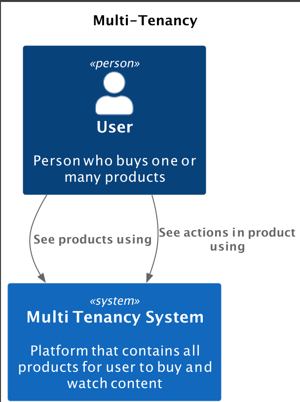
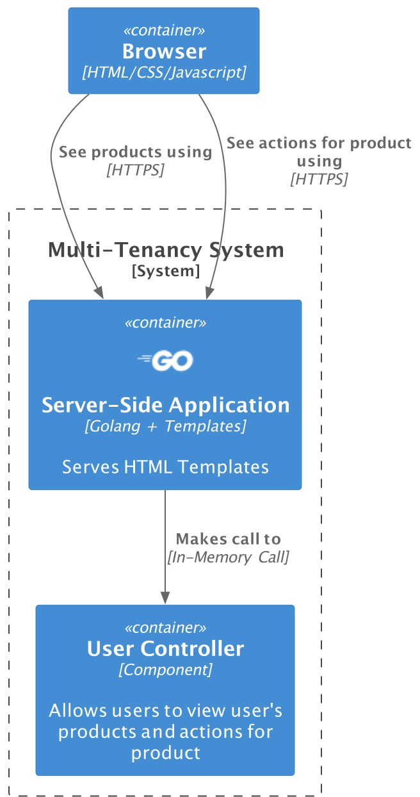
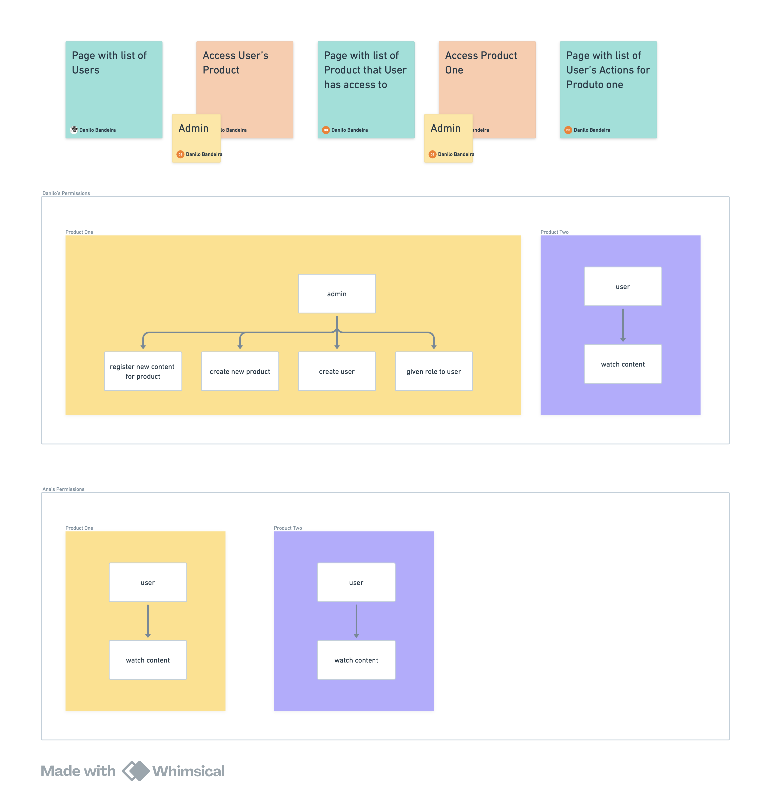

# Running the project

```bash
go run main.go
```

# Architecture

Context


Container


Example




are the files in `@docs` folder

Architecture writing follows the [C4 Model standard](https://c4model.com). To be able to view it, you need to install `Java` and other tools like `.puml` visualizer.
